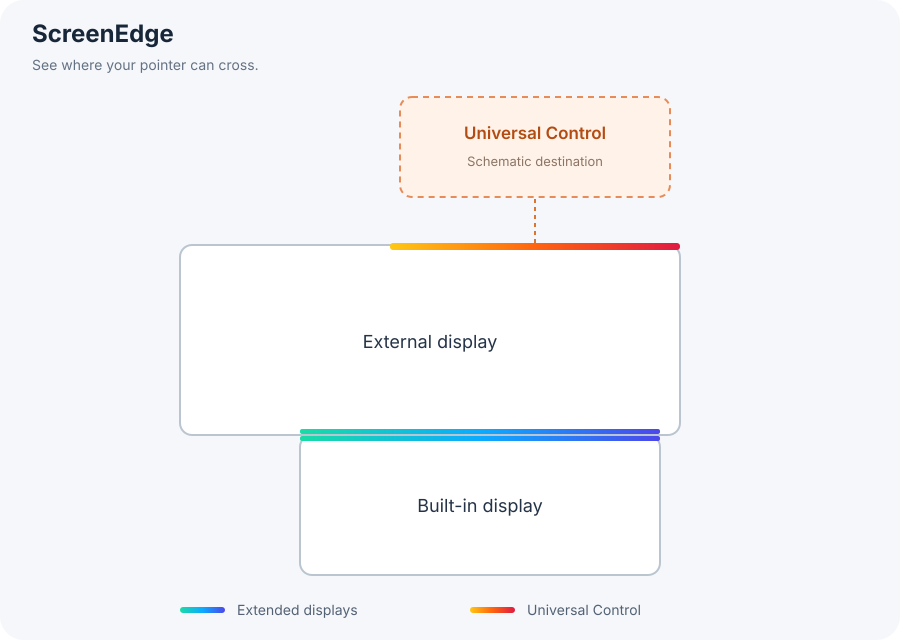

# 跨屏边缘 · ScreenEdge

一个原生 macOS 菜单栏小工具：在屏幕边缘显示细线，帮助找到鼠标能跨向另一块屏幕的位置。继续使用苹果自带的扩展屏和通用控制。

[English](README.en.md) · [下载最新版本](https://github.com/vincilawyer/ScreenEdge/releases/latest) · [MIT 开源许可](LICENSE)

由另一台 Mac 上的 AI 接续构建或安装时，请先阅读 [AI 维护与 Apple 芯片 Mac 接续说明](docs/ai-maintenance.md)。



## 下载

在 [Releases](https://github.com/vincilawyer/ScreenEdge/releases/latest) 下载 `ScreenEdge-1.3.0-macOS-arm64.zip`，解压后把 **跨屏边缘.app** 放入“应用程序”文件夹，再双击打开。预编译版适用于 Apple 芯片（M1 及更新）Mac，要求 macOS 13 或更新版本；Intel Mac 可从源码构建。当前源码为 1.5.0 / 7，包含镜像兼容修复、鼠标所在屏幕模式和独立外观设置；上述 v1.3.0 发布包不含这些更新。需要这些更新时请从最新 `main` 分支构建，详见 AI 维护说明。

下载包采用临时签名，**尚未经过 Apple 公证**。首次打开可能需要按[苹果官方说明](https://support.apple.com/en-gb/102445)确认打开；也可以选择从源码构建。Release 同时提供 SHA-256 校验文件。

## 使用

1. 打开 **跨屏边缘.app**，菜单栏会出现双屏图标。
2. **扩展屏**：保持“自动标记扩展屏交界”开启。细线标记真正相邻且重叠的边缘；插拔显示器、改变排列或唤醒后自动刷新。镜像屏幕不作为跨屏通道。
3. **通用控制（另一台 Mac / iPad）**：保持“自动标记通用控制通道”开启。系统连接后，本机实际可通行的边缘会自动显示对应的提示线，无需手动填写边缘和范围。每约 3 秒刷新；系统返回空结果、读取失败或关闭开关时会清除自动通用控制提示。
4. 另一台 Mac 如需显示返回方向的提示线，也要运行本应用；iPad 无法运行这个 Mac 应用。如当前系统不支持自动读取，可用“手动补充标记”选择本机屏幕、边缘、起止位置。手动标记不能判断设备连接状态，需自行开关。
5. 在设置或菜单栏的“显示模式”中选择：默认“始终显示全部通道”；“靠近边缘时显示全部通道”在距离任意本机屏幕的任意一条边约 110 点以内显示全部提示线；“仅鼠标所在屏幕显示”在鼠标所在屏幕显示其全部通道，其他屏幕隐藏。通用控制两端都需安装新版并选择第三种模式。鼠标被系统或其他应用隐藏时，第三种模式也会隐藏提示线，移动鼠标后恢复。支持 2–8 点粗细。“预览 4 秒”仍临时在各本机屏幕左侧显示扩展屏样式、右侧显示通用控制样式，不受模式筛选，不会保存为真实通道。
6. 设置按“边缘显示、边缘样式、屏幕与通道、手动标记、锁屏与启动”分组，修改自动保存。关闭设置窗口后工具仍在后台运行；可在“锁屏与启动”关闭“显示菜单栏图标”，边缘提示继续工作。隐藏后重新打开“跨屏边缘.app”即可进入设置、恢复图标；在设置窗口按 ⌘Q 或通过应用菜单的“退出跨屏边缘”退出。登录启动默认关闭，需在设置中自行开启。建议先把应用放到长期保留的位置，再开启登录启动。

## 边缘样式

在“边缘样式”页先选择 **扩展屏** 或 **通用控制** 卡片，再编辑该类边缘，立即生效并自动保存：

- **渐变**：海岸、日落、极光、暮紫、月光五组配色，或自定义起始色和结束色。
- **纯色**：七种柔和预设，也可以用系统颜色选择器自由选色。
- 在同一页调整 **2–8 点粗细**（两类通道共用），以及每类独立的 **15%–100% 不透明度**。

新安装默认霜白 / 雾蓝半透明纯色；旧版毛玻璃配置会自动转为相同颜色和不透明度的纯色。已有配置升级保留原蓝绿 / 橙红渐变，直到用户主动调整或恢复默认外观。手动标记沿用通用控制外观。两台 Mac 的设置各自保存，不通过网络同步；若希望两端渐变对应，需要在两台 Mac 选择相同配色。静态示意图展示的是旧版渐变示例。

设置中的预览会实时反映粗细、配色和透明度。详见 [外观实现与验证边界](docs/appearance.md)。

## 屏幕与通道预览

本机屏幕按实际排列显示；每段通用控制入口通过虚线连接到对应方向的“通用控制对端”屏幕卡片。卡片注明“示意 · 非实际比例”，帮助看见通道通向的另一处空间。当前接口没有提供远端设备名称和完整屏幕尺寸，卡片不表示远端真实大小、精确布局或设备总数；多个入口可能通往同一台设备。示意卡片只出现在设置预览中，不会产生虚假的实际屏幕或覆盖层。

## 渐变色如何对应

选择渐变材质时，扩展屏自动通道的两端使用同一组渐变色。左右相邻的屏幕从上往下渐变，上下相邻的屏幕从左往右渐变；颜色只铺在真正相接的那段边缘上。即使屏幕尺寸、缩放倍率不同，源屏幕某个位置的颜色也与目标屏幕相应进入位置的颜色对应。

选择渐变材质时，通用控制在系统返回的本机通道范围内绘制所选渐变，方向同样为从上到下或从左到右。这次已验证一台 Mac 的真实通道读取与显示；两台 Mac 同时运行时的出入口颜色对应，还需要两端实测，不能仅凭本机数据保证。手动补充标记也在选定范围内渐变，范围需自行校准。

提示线穿透鼠标点击，不获取键盘焦点；应用不拦截、注入或移动键鼠，不更改显示器排列，不替代苹果通用控制。不请求辅助功能、输入监控或屏幕录制权限，不访问网络。

## 支持范围

- macOS 13+；当前预编译下载为 Apple Silicon（arm64）。
- 普通扩展屏：使用公开的 NSScreen / CoreGraphics 坐标，自动绘制双向交界。
- 通用控制：1.1.0 使用系统 UniversalControl 私有框架的基本只读 XPC 接口。已在 macOS 26.6.2 实测成功；其他系统版本尚未实测。接口不兼容时提示状态，并保留手动补充功能。实现说明见 [通用控制读取记录](docs/universal-control.md)。
- 支持“锁屏时显示边缘”和“锁屏时保持常显”，仅适用于已登录后进入锁屏。通过临时 SkyLight 覆盖层显示提示线，不显示设置窗口；解锁后恢复桌面显示方式。原生模拟切换检查已通过，用户也已在 Intel / macOS 15.7.9 本机实际锁屏后确认提示线可用，详见 [锁屏支持与验证边界](docs/lock-screen.md)。重启后首次登录、FileVault、独占显示和其他系统界面不在保证范围内。
- “仅鼠标所在屏幕显示”同时读取本机鼠标坐标和可见状态，不把鼠标离开后残留的坐标当作仍在本机；锁屏时也保持此规则。鼠标可见性依赖已弃用的只读系统接口，不可用时隐藏提示并在设置中说明。镜像屏共享同一桌面画面，无法分别控制镜像副本。实现与实测边界见 [鼠标所在屏幕模式](docs/pointer-screen.md)。该模式尚未包含在现有 v1.3.0 发布包中。
- 此次本机使用临时签名，无 Apple Developer ID 公证。换机分发需自行签名/公证或从源码构建；无需关闭系统安全保护。

## 构建与检查

需要 macOS 和 Xcode Command Line Tools，无第三方依赖：

```sh
git clone https://github.com/vincilawyer/ScreenEdge.git
cd ScreenEdge
./scripts/build.sh
./scripts/test.sh
open "build/跨屏边缘.app"
```

输出在 `build/跨屏边缘.app`。打包另需 Python 3。运行 `./scripts/package.sh` 会重新构建，并在 `dist/` 生成 ZIP 和 SHA-256 校验文件。默认构建 arm64，也可以指定 Intel 架构：

```sh
SCREENEDGE_ARCH=x86_64 ./scripts/build.sh
```

注意：架构选项会覆盖同一个构建产物，换机交付前应在目标系统测试。

在已登录的 macOS 图形会话中执行原生覆盖层检查（临时设置，不写入用户配置）：

```sh
"build/跨屏边缘.app/Contents/MacOS/ScreenEdge" --smoke-test
# 已连接通用控制时，读取真实通道并验证绘制与清除
"build/跨屏边缘.app/Contents/MacOS/ScreenEdge" --uc-check
```

`--settings` 强制显示设置窗口。测试需要能连接 WindowServer；受限沙箱内可能无法读取显示器。`--uc-check` 在没有活动通道时报告 `INCONCLUSIVE` 并返回退出码 2，不将空结果视为真实通道绘制已通过。

## 验证

- 138 项几何与配置检查（含镜像副屏通道映射与解除镜像后的失效）：扩展屏相邻范围、通用控制四边坐标转换、非零屏幕原点、未知设备与无效数据、渐变方向、旧设置升级、配置保存，以及对端示意的方向、连接点、避让和清除。新增覆盖鼠标所在屏幕筛选、共享边界、屏幕间空隙、隐藏或未知状态、模式迁移与锁屏优先级，以及独立外观保存、旧配色迁移、损坏字段回退和颜色范围。
- 原生检查覆盖：覆盖层真实窗口位置、鼠标穿透、不可激活、全屏/桌面标志、主开关、方向切换、靠近模式、删除；两组渐变在不同长度下的渲染采样。1.1.0 在两块真实显示器上再次验证扩展屏对应坐标（10 组采样），并同时验证外屏上的通用控制入口。
- 1.1.0 通用控制实测：成功读取 1 段真实通道并匹配本机屏幕；自动暖色覆盖层位置正确。注入空结果和读取错误，以及关闭自动开关，均能移除旧覆盖层。真实设备断连重连和两台 Mac 两端颜色对应尚未实测。
- UI 实测覆盖：添加标记、方向和范围调整；实机从一块屏幕增加到两块时自动更新交界；1.1.0 自动通用控制开关清除/恢复通道，升级保留 3 点粗细与靠近显示设置。
- 1.2.0 新增预览中的通用控制对端卡片，配色改为蓝绿与橙红。原生检查验证：靠近单个通道时所有提示线显示；靠近没有通道的屏幕边缘时所有提示线也显示；移回屏幕中央后全部隐藏。
- 1.3.0 新增“显示菜单栏图标”开关。实机验证隐藏后的窗口重开与应用完全退出后重新启动：隐藏偏好保留，设置窗口可访问，原有边缘和登录项设置保留。
- 1.5.0 新增两类通道的独立配色和不透明度，并将粗细统一放入“边缘样式”；原生检查覆盖各渐变和自定义色的方向与缩放、纯色采样、透明度、配色切换、旧毛玻璃配置迁移。浅色、深色与最小窗口的设置视图已检查。
- 登录项未自动开启。

## 项目来源与查找记录

本项目为本次需求独立编写，没有复制其他项目代码。检索 GitHub 后，未找到能直接满足“保留系统键鼠共享、只显示可跨屏边缘”的现成项目：

- [ShowyEdge](https://github.com/pqrs-org/ShowyEdge)：显示输入法颜色条。
- [JankyBorders](https://github.com/FelixKratz/JankyBorders)：给窗口描边。
- [MousePortal](https://github.com/ai-eks/MousePortal)：配置光标跳转通道。
- [Cursr](https://cursr.app/)：边界覆盖层在查询时仍列于 Upcoming Features。

这些项目只作为功能对照，并非本项目依赖。查询日期：2026-09-12。

## 保存位置与移除

用户设置存于应用的 `local.screenedge.app` 偏好域，不进入源码仓库。退出应用后即可移除 app；若已开启登录启动，先在应用中关闭。源码、构建产物和用户配置相互独立。

MIT 许可，见 LICENSE。

## 反馈与贡献

欢迎通过 Issues 报告问题或提交 Pull Request。反馈时请说明 macOS 版本、Mac 芯片类型和屏幕排列示意，避免附上真实设备标识或私人诊断信息。
